# Lab [3] Session [3] -- Chaotic Circuits: Build Full Jerk Circuit (Part II)

Date: 19 Mar 2026
Lab Partner: Nathan Unruh
Recorder: Ahilan Kumaresan

Repository: phys332W-sfu/Lab3-Chaotic-Circuits

---

## TABLE OF CONTENTS

SESSION 3 -- 19 Mar 2026

I. Goals

II. Apparatus

III. Pre-Lab Q1 Plots

IV. Pre-Lab Q2 (Due Period 4)

V. Oscilloscope-Laptop Setup

VI. D(x) Re-Test with Data

VII. Building the Jerk Circuit

7.1 Circuit Architecture

7.2 Section 1 Build + Test

VIII. Analysis

IX. Conclusions

X. Plan for Session 4

---

# SESSION 3 -- 19 Mar 2026

**Time:** Lab Period 3

**SESSION FOCUS:** Connect oscilloscope to laptop for data capture. Re-test D(x) nonlinear element and save CSV data. Begin building the full jerk circuit -- completed Section 1 (D(x) + first integrator). Start Pre-lab Q2 derivation.

## I. GOALS

1. Connect oscilloscope to laptop and download Siglent drivers for data capture
2. Re-test D(x) nonlinear element and save waveform data (CSV)
3. Build the full jerk circuit (Lab Script Fig. 1a) -- start with Section 1
4. Test each section individually before connecting
5. Begin Pre-lab Q2: derive Eqs. 2-6 from Kiers et al. (due Lab Period 4)

**Status:** Oscilloscope connected to laptop. D(x) re-tested with data saved. Section 1 of jerk circuit built and tested -- observed beating pattern. Full circuit schematic planned on TinkerCAD.

---

## II. APPARATUS

Same as Sessions 1-2 (see Session 1, Section II). Additional items:

| Item | Details | Purpose |
|------|---------|---------|
| 3x LF411 op amps | For the 3 integrator stages | Jerk circuit core |
| 1x LF411 op amp | Summing amplifier stage | Combines signals |
| 1x LF411 op amp | D(x) nonlinear element (built Session 2) | Piecewise-linear nonlinearity |
| Decade resistor box | R_v variable, ~10 kΩ to 200 kΩ range | Bifurcation control parameter |
| 500 kΩ resistor | Temporary feedback for individual integrator testing | Stabilises integrators before connecting |
| USB cable for oscilloscope | Connect Siglent SDS2352X-E to laptop | Data capture to CSV |

---

## III. PRE-LAB Q1 -- COMPUTED PLOTS (Supplement to Sessions 1-2 Derivation)

**Reference:** Lab Script p. 7; Pre-lab Q1 Part (iii)

The practical integrator ODE (derived in Sessions 1-2):

$$\frac{V_{in}}{R_1} + C_1 \frac{dV_{out}}{dt} + \frac{V_{out}}{R_2} = 0$$

with τ = R2 × C1 = (100 kΩ)(1 nF) = 100 μs.

Below are the computed V_out waveforms for a square wave input at three frequency regimes. These supplement the hand-derivation submitted in Session 2.

### Case 1: T >> τ (T = 2000 μs, f = 500 Hz)

Output reaches steady state each half-cycle. Acts like inverting amplifier with gain -R2/R1. Output is a rounded square wave, inverted.

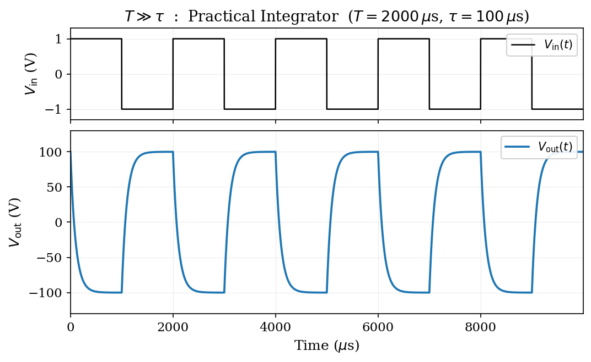

### Case 2: T ~ τ (T = 200 μs, f = 5 kHz)

Clear exponential charging/discharging visible. Intermediate sawtooth shape -- neither fully settled nor purely triangular.

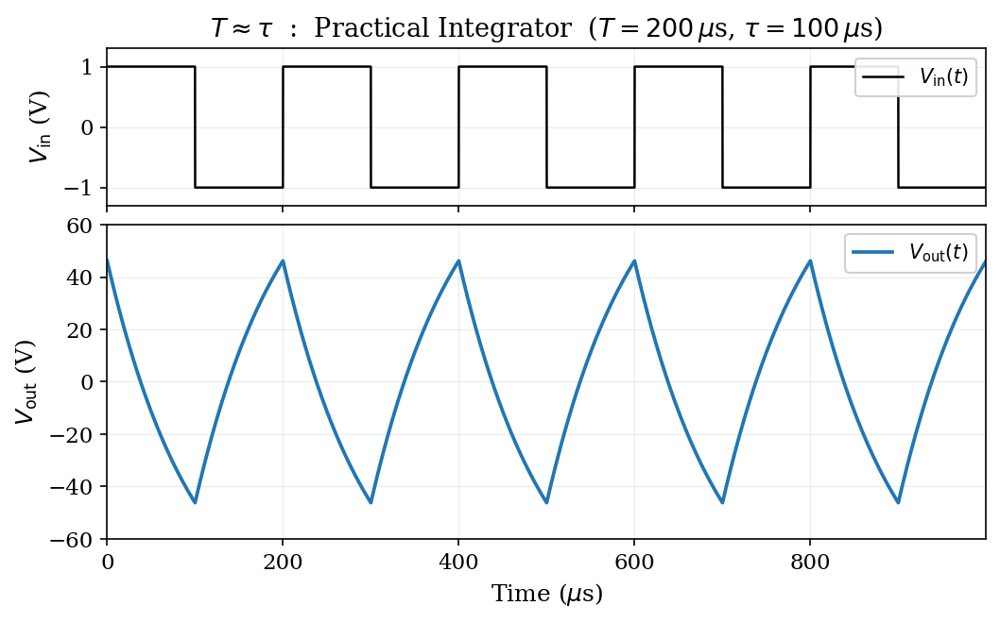

### Case 3: T << τ (T = 20 μs, f = 50 kHz)

Capacitor barely charges each half-cycle. Circuit behaves as pure integrator. Output is a small-amplitude triangular wave.

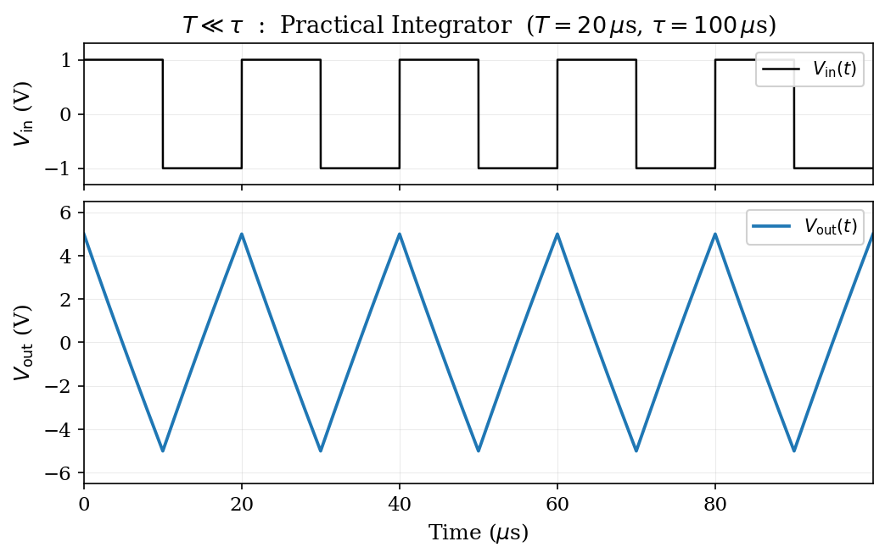

**Key observation:** As frequency increases (T decreases), the waveform transitions from rounded square to sawtooth to triangular, and the amplitude drops dramatically. In the real circuit, the op amp clips at ±15 V rails.

---

## IV. PRE-LAB Q2 (DUE LAB PERIOD 4)

**Reference:** Lab Script p. 7; Kiers et al. (2004), Eqs. 2-6

### Circuit Overview

The full jerk circuit (Lab Script Fig. 1a) consists of three integrators, a summing amplifier, and the D(x) nonlinear element connected in a feedback loop.

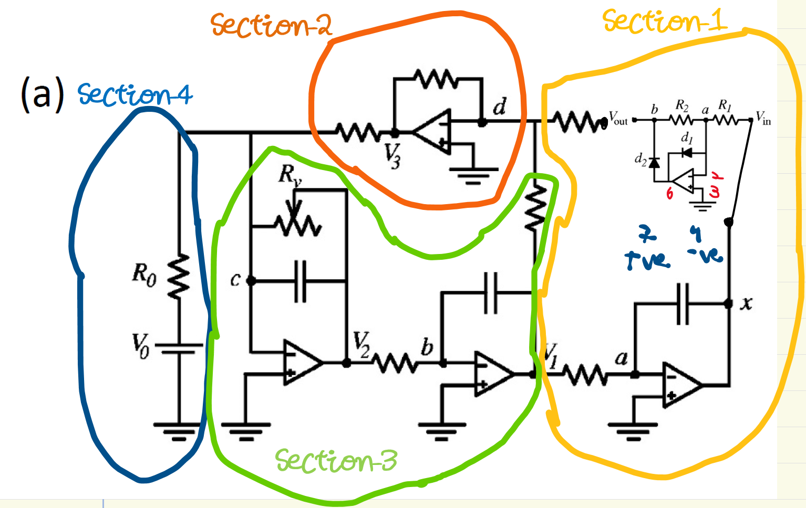

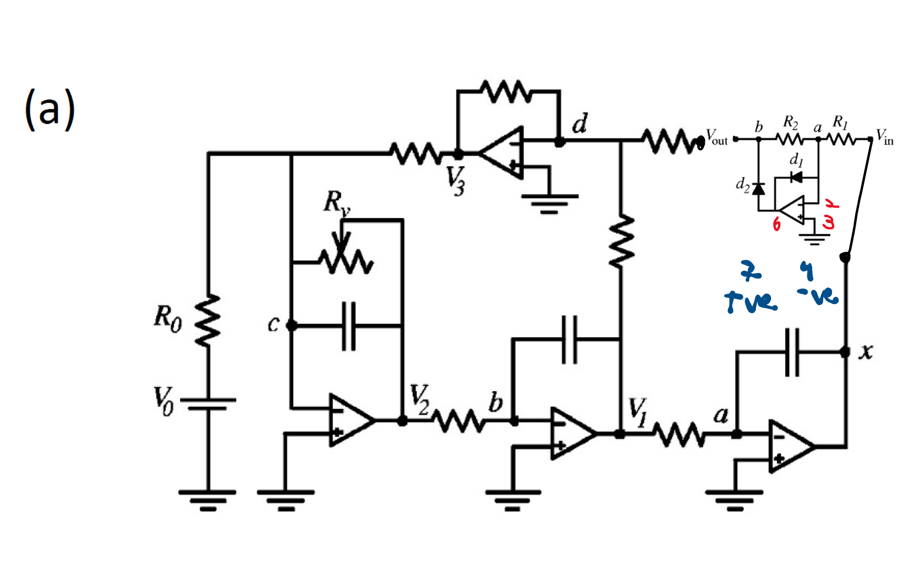

Node labels from the schematic: x (output), a, b, c, d (internal nodes). Each integrator uses R and C with bleed-off resistor R_b.

### Part (a): Derive the dimensionless ODE

**Step 1 -- Integrator at node a (input = x, output = V₁):**

Apply golden rules. Virtual ground at pin 2 (V⁻ = V⁺ = 0). KCL at inverting input:

$$\frac{x}{R} + C \frac{dV_1}{dt} + \frac{V_1}{R_b} = 0$$

Ignoring the bleed-off term (R_b >> R for signal frequencies), and defining dimensionless time s = t/(RC):

$$\frac{dV_1}{ds} = -x$$

So V₁ = -x' (the negative first derivative of x in dimensionless time).

**Step 2 -- Integrator at node b (input = V₁, output = V₂):**

Same analysis:

$$\frac{dV_2}{ds} = -V_1 = x'$$

Integrating: V₂ is proportional to x. Since dV₂/ds = x', we get V₂ = x (up to initial conditions).

**Step 3 -- Summing amplifier at node d (output = V₃):**

The summing amplifier combines four inputs through their respective resistors to the inverting input:

- V₂ (node b) through R → contributes the -ẋ term
- V₃ (node c) through R_v → contributes -(R/R_v) V₃ = -Aẍ term
- D(x) through R → contributes -D(x) term
- V₀ (DC) through R₀ → contributes -(R/R₀) V₀ = -α term

**Step 4 -- Combining all stages:**

After three integrations around the loop, the third derivative of x (the jerk) equals the summing node contributions. The governing ODE is:

$$\dddot{x} = -A\ddot{x} - \dot{x} + D(x) - \alpha$$

This is the jerk equation (Kiers et al. Eq. 6).

### Part (b): Identify circuit parameters

| Parameter | Expression | Physical meaning |
|-----------|-----------|-----------------|
| A | R / R_v | Bifurcation control (set by decade box) |
| α | (R / R₀) V₀ | DC offset parameter |
| D(x) | -(R₂/R₁) min(x, 0) | Piecewise-linear nonlinearity from diodes |
| τ | RC | Time scale of oscillations |
| x | Voltage at output node | Dynamical variable |

**A** is the key control parameter. By varying R_v with the decade resistor box:
- Large R_v → small A → stable fixed point
- Decrease R_v → increase A → Hopf bifurcation → periodic → period-doubling → chaos

**α** sets the DC offset. With R₀ >> R and V₀ small, α ≈ 0 for our circuit.

**D(x)** uses the piecewise-linear element built in Session 2:
- x > 0: D(x) = 0 (diodes reverse-biased)
- x < 0: D(x) = -(R₂/R₁) x ≈ 6|x| (diodes conduct, gain ≈ 6)

---

## V. OSCILLOSCOPE-TO-LAPTOP SETUP

**Time:** Start of lab period

Connected the Siglent SDS2352X-E oscilloscope to laptop via USB cable.

Steps completed:
1. Connected USB cable from oscilloscope rear panel to laptop
2. Oscilloscope recognized by laptop as USB device
3. Tested saving waveform data -- CSV export works directly from the oscilloscope save menu
4. Tested saving screenshots as PNG -- also works from save menu
5. Verified CSV format: 12-line header with metadata (record length, sample interval, vertical/horizontal scales), then 3 columns (Time, CH1, CH2)

No additional driver software was needed -- the oscilloscope saves directly to USB storage.

---

## VI. D(x) RE-TEST WITH DATA CAPTURE

**Time:** After oscilloscope setup

Re-tested the D(x) nonlinear element (built in Session 2) to verify it still works and to capture proper waveform data.

**Test conditions:**
- V_in: Square wave, 1 V RMS, 1 kHz
- CH1 (Yellow): V_in
- CH2 (Magenta): V_out from D(x)

### Saved Data Files

| File | Description | Record Length |
|------|------------|-------------|
| Data/Session-3/Test-D_x-Zoom-in-SDS00002.csv | Zoomed in, 0.1 μs/div | 1,400 pts |
| Data/Session-3/Test-D_x-Zoom-out-SDS00003.csv | Zoomed out, 100 μs/div | 1,400,000 pts |

### Oscilloscope Screenshots

The oscilloscope display shows V_in (yellow) as a large-amplitude waveform and V_out from D(x) (magenta) as a smaller signal that only responds to the negative portion of V_in.

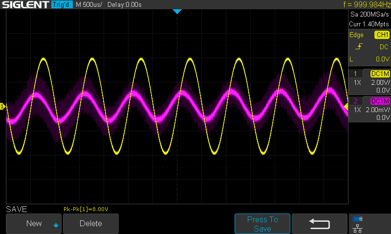

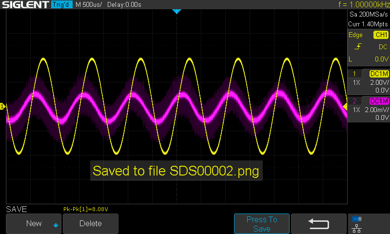

### Python Analysis Plots

Data plotted using Python notebook: Analysis/Session3/Session3-Dx-Plots.ipynb

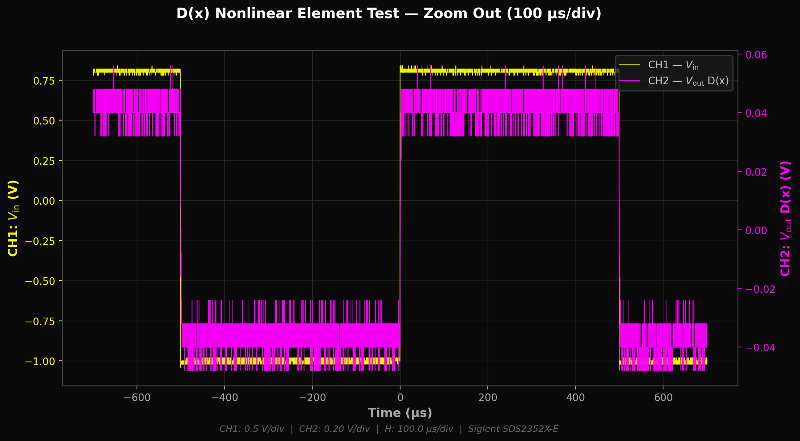

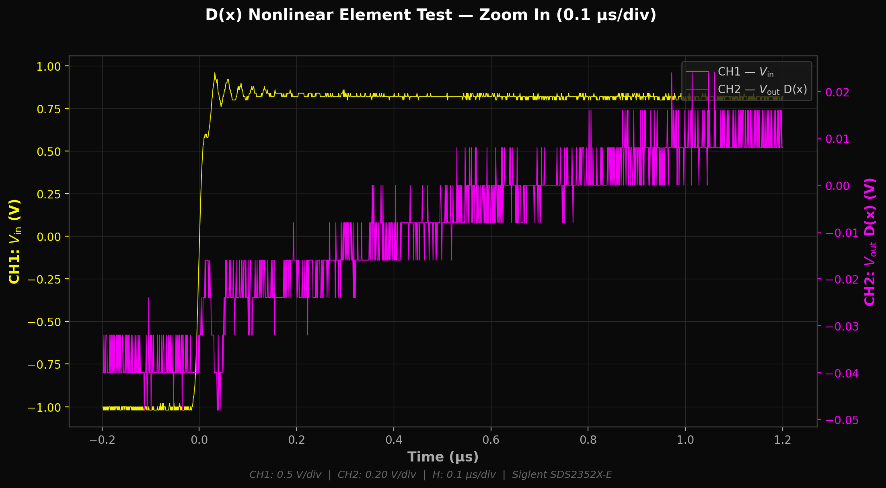

**Observation:** D(x) is working correctly. CH2 shows the piecewise-linear response -- output appears only when V_in goes negative (diodes conduct). The signal amplitude is small (~40 mV) consistent with the 0.2 V/div CH2 scale.

---

## VII. BUILDING THE FULL JERK CIRCUIT

**Reference:** Lab Script Fig. 1a, p. 7-8

### 7.1 Circuit Architecture

The jerk circuit consists of 5 op amp stages:
1. **Section 1 (rightmost, node a):** D(x) + first integrator -- input is x, output is V₁
2. **Section 2 (top, node d):** Summing amplifier -- combines all feedback terms
3. **Section 3 (bottom, node b):** Second integrator -- input is V₂, output is V₁
4. **Section 4 (left, node c):** Third integrator with R_v -- bifurcation control

All integrators use: R = 10 kΩ, C = 1 nF, R_b = 100 kΩ (bleed-off).

> **IMPORTANT (Lab Script p. 8):** Use 1 nF capacitors (NOT 1 μF from Kiers et al.). This speeds up the circuit by 1000x, making frequencies audible and oscilloscope-friendly.

### 7.2 Section 1 Build and Test

Built Section 1 of the jerk circuit first -- this includes the D(x) nonlinear element (already built in Session 2) connected to the first integrator stage.

**Virtual planning:** Used TinkerCAD to plan the full breadboard layout before building.

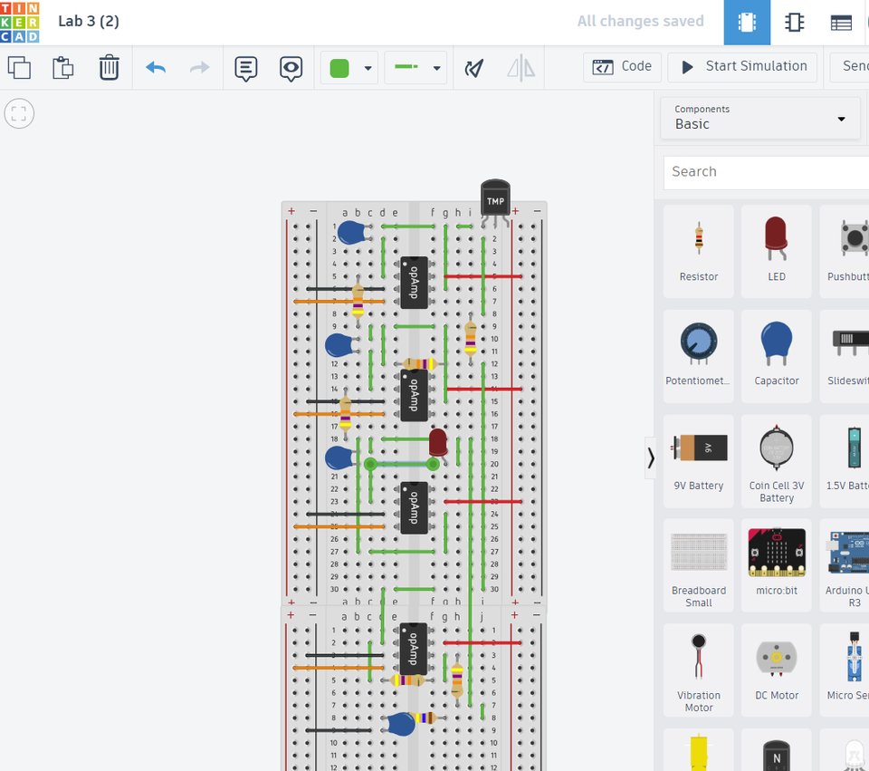

 part.png)

**Physical build:**

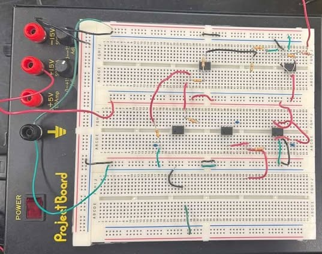

**Section 1 test result:**

Applied 1 kHz input. The V_out from Section 1 shows some kind of beating pattern -- the amplitude modulates over time.

Saved waveform data: Data/Session-3/SDS00001.csv

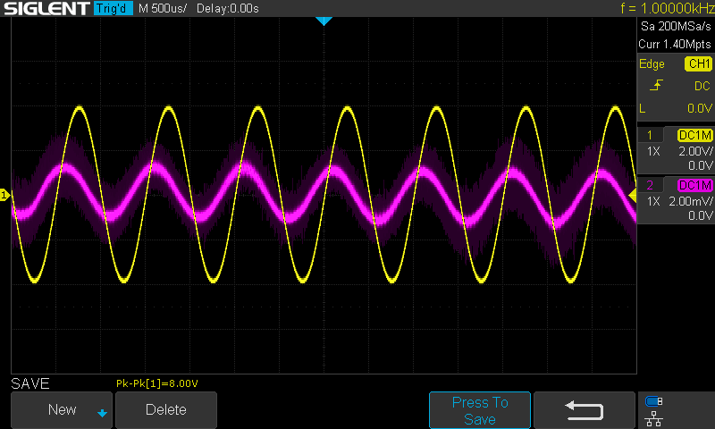

**Observation:** The beating pattern suggests two close frequencies are interfering. This could be caused by:
- The bleed-off resistor R_b creating a natural frequency close to the input frequency
- Feedback from the D(x) element adding a second frequency component
- An unwanted oscillation in the op amp circuit

This needs investigation in Session 4 when the full circuit is connected.

---

## VIII. ANALYSIS

| Task | Status | Key Result |
|------|--------|------------|
| Oscilloscope-laptop connection | Completed | USB direct, CSV + PNG export working |
| D(x) re-test | Completed | Piecewise-linear response confirmed, data saved |
| Section 1 build | Completed | Beating pattern observed |
| Section 2-4 build | Not started | Planned with TinkerCAD |
| Pre-lab Q2 | Started | Jerk equation derivation written |

---

## IX. CONCLUSIONS

**Session 3 Progress:**
- Successfully connected oscilloscope to laptop for direct data capture (CSV and PNG)
- Re-tested D(x) and confirmed it works correctly with saved waveform data
- Built Section 1 of the jerk circuit (D(x) + first integrator) -- observed unexpected beating pattern
- Created complete circuit layout plan in TinkerCAD for remaining sections
- Started Pre-lab Q2 derivation of the jerk equation

**Key observation:** Section 1 produces a beating pattern at 1 kHz input. The full circuit is not yet complete -- Sections 2-4 still need to be built and connected.

**Outstanding issues:**
- Beating in Section 1 needs investigation
- Sections 2-4 not yet built
- Pre-lab Q2 needs finalisation

---

## X. PLAN FOR SESSION 4

**Lab Period 4** (Lab Script Timeline):
1. Hand in Pre-lab Q2 (derive Eqs. 2-6 -- finalise derivation)
2. Complete building Sections 2-4 of the jerk circuit
3. Test each section individually with 500 kΩ temporary feedback
4. Connect full circuit and power on
5. Vary R_v to observe: stable → periodic → period-doubling → chaos
6. Capture time series and phase portraits at key R_v values
7. Begin Pre-lab Q3: numerically solve the jerk ODE
