# Lab [3] Sessions [1-2] -- Chaotic Circuits: Op Amp Fundamentals (Part I)

Date: 12 Mar 2026 (Session 1), 17 Mar 2026 (Session 2)
Lab Partner: Nathan Unruh
Recorder: Ahilan Kumaresan

Repository: `phys332W-sfu/Lab3-Chaotic-Circuits`

---

## TABLE OF CONTENTS

SESSION 1 -- 12 Mar 2026

I. Goals

II. Apparatus

III. Variables

IV. References

V. Background: Op Amp Theory

VI. Pre-Lab Planning

VII. Procedure

7.1 Breadboard Setup

7.2 Exp 1: Unity-Gain Inverter

7.3 Exp 2: Variable Gain

7.4 Exp 3: Integrator (Smoke)

VIII. Session 1 Analysis

IX. Session 1 Conclusions

X. Plan for Session 2

POST-LAB / PRE-LAB

Pre-Lab Question 1

SESSION 2 -- 17 Mar 2026

XI. Goals

XII. Apparatus (Additional)

XIII. References

XIV. Breadboard Verification

XV. Procedure

15.1 Exp 2: Variable Gain

15.2 Exp 3: Integrator

15.3 Exp 4: Summing Amplifier

XVI. Begin Part II: D(x)

XVII. Session 2 Analysis

XVIII. Conclusions

XIX. Plan for Session 3

---

# SESSION 1 -- 12 Mar 2026

**Time:** ~1:28 PM start

**SESSION FOCUS:** Introduction to op amps. Spent most of session debugging noisy signals and a faulty op amp. Reached Exp 2 briefly. Exp 3 ended in smoke.

## I. GOALS

1. Build and test 4 op amp subcircuits: unity-gain inverter, variable-gain inverter, practical integrator, summing amplifier
2. For each, predict V_out from V_in using golden rules, compare to oscilloscope
3. Begin Pre-lab Q1: derive ODE for practical integrator
4. Prepare for Session 2: understand how subcircuits combine into the jerk circuit (Lab Script Fig. 1a)

**Status:** Exp 1 completed with debugging. Exp 2 started. Exp 3 smoke incident. Exp 4 not reached.

## II. APPARATUS

| Item | Details | Purpose |
|------|---------|---------|
| Breadboard | Built-in ±15 V and +5 V supplies | Circuit construction and power |
| Function generator | Keysight 33210A | AC input signals and DC offset |
| Oscilloscope | Siglent SDS2352X-E, 350 MHz | Measure V_in and V_out |
| Oscilloscope probes | High-impedance (x1 or x10) | Monitor voltages |
| Op amps | LF411 (8-pin DIP) | Core amplifier element |
| Resistors | 10 kΩ (x4), 20 kΩ, 47 kΩ, 100 kΩ | Input, feedback, bleed-off |
| Capacitors | 1 nF | Integrator feedback |
| Cables/adapters | BNC cables, T-adapters, hook-up wire | Signal routing |

> **Note:** Check probe attenuation (x1 vs x10). Using x10 when scope expects x1 shows 10x too small. Direct wires often give cleaner signals than BNC clips/probes.

## III. VARIABLES

| Type | Variable | Values / Range | Description |
|------|----------|---------------|-------------|
| Independent | R₂/R₁ ratio | 1, 2, 4.7, 10 | Sets amplifier gain |
| Independent | Input frequency f | 100 Hz to 1 MHz | Tests integrator regimes |
| Independent | Input waveform | Triangle, square, sine | Different experiments |
| Dependent | V_out(t) | Measured on scope | Output voltage |
| Dependent | Gain G = V_out/V_in | Measured | Compared to -R₂/R₁ |
| Controlled | Power supply | ±15 V | Fixed op amp rails |

## IV. REFERENCES

1. PHYS 332 Lab Script: "Chaotic Circuit" (PCH, revised Jan 2025) -- Part I, pp. 3-7
2. K. Kiers, D. Schmidt, J. C. Sprott, Am. J. Phys. 72, 503-509 (2004)
3. Advanced Physics Lab Handout Electronics Tips (Canvas)
4. P. Horowitz and W. Hill, The Art of Electronics, Ch. 4

## V. BACKGROUND: OP AMP THEORY

**Reference:** Lab Script pp. 3-5, Horowitz and Hill Ch. 4

An op amp is a high-gain (~10⁶) differential amplifier IC with high input impedance and low output impedance. Supply: ±15 V. Always used with feedback.

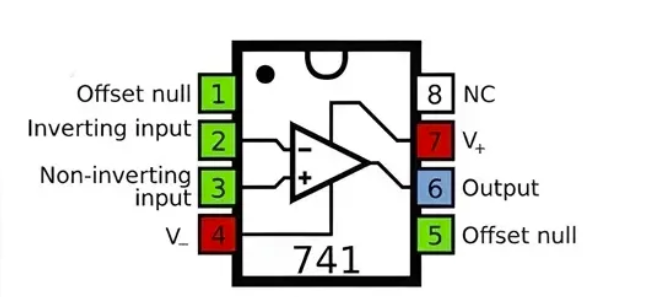

**LF411 Pinout** (half-moon notch on LEFT, pins counterclockwise):

| Pin | Function |
|-----|----------|
| 1 | BALANCE (floating) |
| 2 | Inverting input (V⁻) |
| 3 | Non-inverting input (V⁺) |
| 4 | V⁻ → connect to -15 V |
| 5 | BALANCE (floating) |
| 6 | Output (V_out) |
| 7 | V⁺ → connect to +15 V |
| 8 | NC (no connection) |

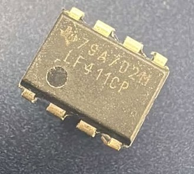

**The Op Amp Golden Rules** (with negative feedback):
1. The inputs draw no current (infinite input impedance)
2. The output drives V⁺ = V⁻ (zero voltage difference)

> **CONCLUSION:** These two rules + KCL at the inverting input are sufficient to analyze ALL circuits in this lab.

**Clipping:** V_out cannot exceed ±15 V supply rails.

**Resistor colour code:** Brown-Black-Orange-Gold = 10 kΩ.

## VI. PRE-LAB PLANNING

**Time:** ~1:28 PM

Before starting experiments, identified tools for future pre-lab work:
- TinkerCAD breadboard simulator for planning layouts
- LT Spice for circuit simulation
- Initial challenge: figuring out pin mapping for LF411 on the physical breadboard

## VII. PROCEDURE

### 7.1 Breadboard Setup

1. Turned on breadboard power supply, verified ±15 V and +5 V rails
2. Ran +15 V and -15 V along the long power rails
3. Inserted LF411 chip with half-moon notch on LEFT
4. Wired: Pin 7 to +15 V, Pin 4 to -15 V, Pin 3 to GND

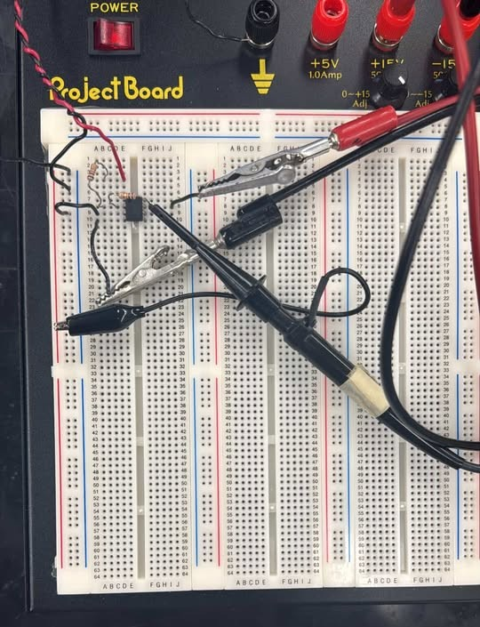

### 7.2 Experiment 1: Unity-Gain Inverting Amplifier

**Reference:** Lab Script p. 6, top circuit

**Circuit:** R₁ = R₂ = 10 kΩ. Pin 3 to GND.

**Golden Rule derivation:** By Rule 2, V⁻ = V⁺ = 0 (virtual ground). By Rule 1, no current into pin 2. KCL at pin 2:

$$\frac{V_{in}}{R_1} + \frac{V_{out}}{R_2} = 0$$

so:

$$V_{out} = -\frac{R_2}{R_1} V_{in} = -V_{in}$$

**Expected:** G = -R₂/R₁ = -1. Inverted copy of input, same amplitude.

**Procedure:**
1. Built circuit with R₁ = R₂ = 10 kΩ
2. Function generator: 1 kHz triangle wave, ~1 Vpp, zero DC offset
3. T-adapter split signal: one to scope Ch1 (V_in), one to circuit
4. Ch2 probe to pin 6 (V_out)

#### 7.2.1 Troubleshooting: Noisy/Unstable Signal

> **Problem:** Triangle signal was very unstable -- kept bouncing on the oscilloscope.

Debugging steps:
1. Tried new oscilloscope -- did not help
2. Changed BNC cable -- did not help
3. Pressed Sync BNC tighter -- helped somewhat (loose connection on the oscilloscope sync plug)
4. **Grounded probes to breadboard -- helped significantly**
5. Direct wire connections performed better than BNC clips (less internal resistance)
6. Still noisy after connecting ±V power
7. **TA identified root cause: faulty op amp chip** -- wide-band noise when powered

> **Lesson:** Op amps fail frequently (Lab Script p. 8 warning). If circuit misbehaves after checking connections, replace the chip first.

#### 7.2.2 Measurements (After Replacing Op Amp)

| Parameter | Predicted | Measured |
|-----------|-----------|----------|
| V_in (Ch1, yellow) | 1.0 Vpp | 1.0 Vpp |
| V_out (Ch2, pink) | 1.0 Vpp | 2 Vpp |
| Gain |G| | 1.00 | ~2 |
| Phase shift | 180° | Confirmed inverted |

> **Note:** Measured |G| = 2 instead of expected 1. Investigated in Session 2 -- likely probe attenuation mismatch (x1 vs x10).

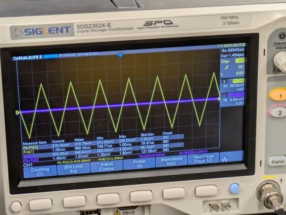

### 7.3 Experiment 2: Variable Gain (STARTED)

**Reference:** Lab Script p. 6, second circuit

Same as Exp 1 but vary R₂. R₁ = 10 kΩ fixed. Predicted G = -R₂/R₁.

Only identified R₂ = 10 kΩ (colour code: Brown-Black-Orange-Gold). Higher gains not tested due to time spent on Exp 1. Carried to Session 2.

### 7.4 Experiment 3: Integrator (ATTEMPTED -- SMOKE INCIDENT)

**Reference:** Lab Script p. 6, third circuit; Pre-lab Q1

**Prediction made:** Square wave input → square wave output with 180° phase shift.

> **Note:** This prediction was incorrect. For an integrator, square in → triangular out. Corrected after completing Pre-lab Q1.

#### 7.4.1 Circuit Failure

While building the integrator, no V_in reading appeared. We:
1. Cleaned resistor leads
2. Checked capacitor polarity
3. Tried removing the parallel resistor

> **Incident:** Within seconds of removing the parallel resistor, **smoke came out**. Immediately unplugged.

Investigation: Taped over damaged area. Replaced all components. Found a wire with a black stain. Root cause unclear -- possible short circuit.

> **Action for Session 2:** Systematically verify breadboard with DMM before building any circuits.

## VIII. SESSION 1 ANALYSIS

| Experiment | Status | Key Result |
|------------|--------|------------|
| Exp 1: Unity-gain inverter | Completed (with debugging) | |G| = 2 instead of 1 |
| Exp 2: Variable gain | Started only | 10 kΩ identified |
| Exp 3: Integrator | Smoke incident | Circuit failed |
| Exp 4: Summing amp | Not started | -- |

## IX. SESSION 1 CONCLUSIONS

Primarily a learning/debugging session:
1. Op amps fail frequently -- replace chip before extensive debugging
2. Ground oscilloscope probes to breadboard to reduce noise
3. BNC connections must be firm -- sync plug trick helps with faulty scope
4. Direct wires often better than BNC clips/probes (less internal resistance)
5. Breadboard integrity cannot be assumed -- verify with DMM

## X. PLAN FOR SESSION 2

1. Verify breadboard with DMM
2. Hand in Pre-lab Q1
3. Resolve Exp 1 gain discrepancy
4. Complete Experiments 2, 3, 4
5. Build D(x) nonlinear element if time permits

---

# PRE-LAB QUESTION 1 (HANDED IN)

**Reference:** Lab Script p. 7

### Part (i): Derive the ODE

Circuit: R₁ = 10 kΩ (input), C₁ = 1 nF (feedback capacitor), R₂ = 100 kΩ (bleed-off, parallel with C₁). Pin 3 to GND.

By Golden Rule 2: V⁻ = V⁺ = 0 (virtual ground). By Rule 1: no current into pin 2.

KCL at pin 2:

$$\frac{V_{in}}{R_1} + C_1 \frac{dV_{out}}{dt} + \frac{V_{out}}{R_2} = 0$$

Rearranging to standard first-order linear ODE:

$$R_1 C_1 \frac{dV_{out}}{dt} + \frac{R_1}{R_2} V_{out} = -V_{in}$$

**Time constant:** τ = R₂ × C₁ = (100 kΩ)(1 nF) = 100 μs

### Part (ii): Solution

First-order linear ODE. Using integrating factor IF = e^(t/R₂C₁):

$$V_{out}(t) = V_{out}(0) e^{-t/\tau} - \frac{1}{R_1 C_1} \int_0^t V_{in}(t') e^{-(t-t')/\tau} \, dt'$$

The exponential decay means the output is a weighted integral with exponential memory loss. The term e^(-t/τ) causes the circuit to "forget" old inputs on the time scale τ.

### Part (iii): Square Wave Input -- Three Regimes

For V_in = square wave with period T, amplitude ±V₀:

**Case 1: T >> τ** (low freq, f = 100 Hz, T = 10 ms >> 100 μs)
- Output reaches steady state each half-cycle
- Acts like inverting amplifier: V_out ≈ -(R₂/R₁) V_in
- Output: rounded square wave, inverted

**Case 2: T ~ τ** (mid freq, f = 10 kHz, T ~ 100 μs)
- Clear exponential charging/discharging
- Intermediate sawtooth shape

**Case 3: T << τ** (high freq, f = 500 kHz, T = 2 μs << 100 μs)
- Capacitor barely charges each half-cycle
- Circuit behaves like pure integrator
- Output: small-amplitude triangular wave

**Most like a simple integral:** Case 3 (T << τ), because R₂ has no time to drain the capacitor.

### Part (iv): Purpose of R₂

R₂ prevents DC charge accumulation on C₁. Without R₂, any DC offset slowly charges C₁, causing V_out to drift to the rails (±15 V). R₂ provides DC negative feedback and bleeds off charge with time constant τ = R₂ × C₁ = 100 μs.

---

# SESSION 2 -- 17 Mar 2026

**SESSION FOCUS:** Complete remaining Part I experiments, verify breadboard after smoke incident, build and test nonlinear element D(x).

## XI. GOALS

1. Verify breadboard integrity with DMM after Session 1 smoke incident
2. Hand in Pre-lab Q1 (done)
3. Resolve Exp 1 gain discrepancy (|G| = 2, expected 1)
4. Complete Experiments 2, 3, and 4
5. Build and test nonlinear element D(x) for Part II

**Status:** All goals completed. Part I finished. D(x) built and tested.

## XII. APPARATUS (Additional to Session 1)

| Item | Details | Purpose |
|------|---------|---------|
| Digital multimeter (DMM) | Available at bench | Breadboard verification |
| Fresh LF411 op amps | Drawers at back | Replace potentially damaged chips |
| 1N4148 diodes (x2) | Back of room | D(x) nonlinear element |
| DC Power Supply | Anatek regulated | DC input for summing amp |
| Decade resistor box | Manual stepping | For Part II: variable R_v |

## XIII. REFERENCES

Same as Session 1 (see Section IV).

## XIV. BREADBOARD VERIFICATION

**DMM Verification Results:**

| Test | Expected | Measured | Pass? |
|------|----------|----------|-------|
| +15 V and -15 V rails | +30.0 V | 31 V | Yes |
| +15 V rail to Ground | +15.0 V | 15.45 V | Yes |
| Breadboard rows | Continuity | Beeps on DMM | Yes |
| Power line points | Continuity | Beeps | Yes |
| Incident area cross-row | Open (no shorts) | Beeps on DMM | Yes |

> **Decision:** Breadboard is safe to use. No permanent damage from Session 1 smoke incident.

## XV. PROCEDURE

### 15.1 Experiment 2: Variable Gain (COMPLETED)

**Reference:** Lab Script p. 6

Same circuit as Exp 1, vary R₂ with R₁ = 10 kΩ fixed. 1 kHz triangle wave, ~1 Vpp.

**Prediction:**

$$V_{out} = -\frac{R_2}{R_1} V_{in}$$

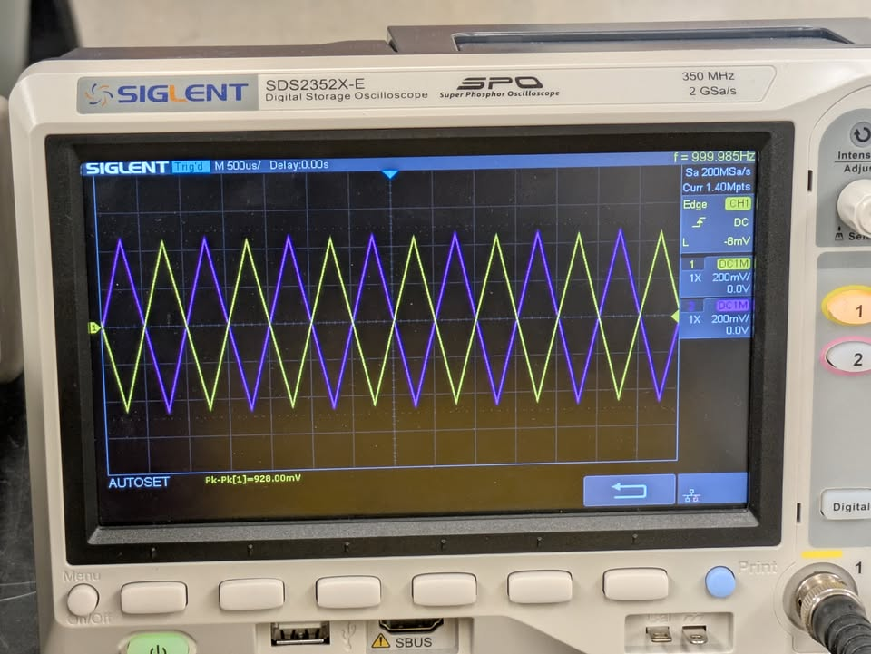

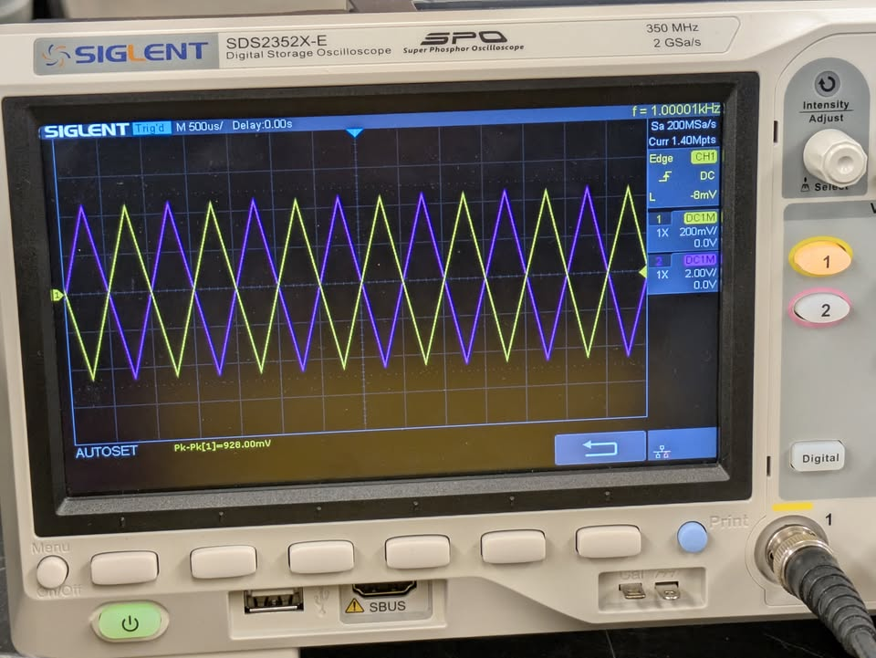

| R₂ (kΩ) | Predicted G = -R₂/R₁ | V_in Pk-Pk | V_out Pk-Pk | Measured G | % Error |
|------------|---------------------|------------|-------------|------------|---------|
| 10 | -1.00 | 928 mV | ~928 mV | ~-1.0 | ~0% |
| 20 | -2.00 | CC | CC | CC | CC |
| 47 | -4.70 | CC | CC | CC | CC |
| 100 | -10.0 | 928 mV | ~9.28 V | ~-10 | ~0% |

### 15.2 Experiment 3: Practical Integrator (COMPLETED)

**Reference:** Lab Script p. 6, third circuit; Pre-lab Q1

We had to change the Function Generator and BNC wires -- much better results.

**Circuit:** R₁ = 10 kΩ, C₁ = 1 nF, R₂ = 100 kΩ (parallel with C₁). Pin 3 to GND.

**Key time constant:** τ = R₂ × C₁ = 100 μs, f = 1/(2πτ) ≈ 1.6 kHz

**Input:** Square wave, ~1 Vpp, zero DC offset. Tested at multiple frequencies to verify Pre-lab Q1 predictions.

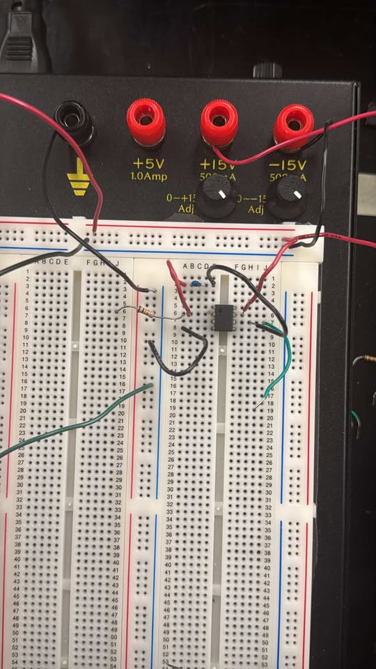

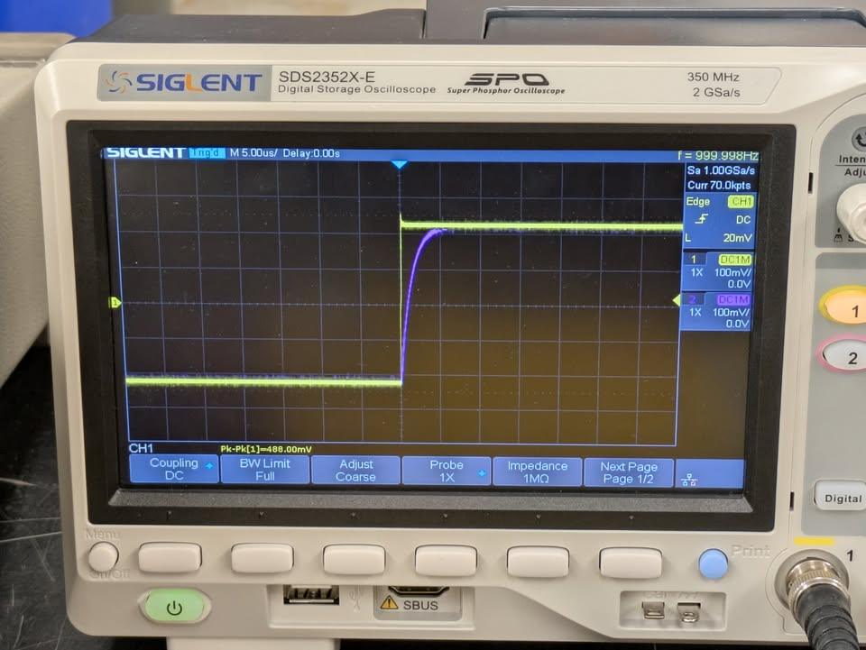

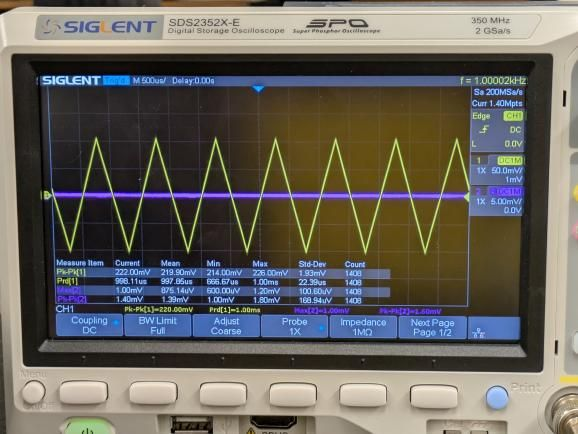

**DC offset test:** Removed R₂ (pure integrator). Applied small DC offset. As we lower the DC offset, the graphs become more chaotic -- this demonstrates why R₂ is essential. Without it, the integrator drifts to the rails.

### 15.3 Experiment 4: Summing Amplifier (COMPLETED)

**Reference:** Lab Script p. 6, bottom circuit

**Circuit:** R_a = R_b = R_f = 10 kΩ. V_in,1 (AC) through R_a to pin 2. V_in,2 (DC) through R_b to pin 2. Pin 3 to GND.

**Golden Rule derivation:** V⁻ = 0 (virtual ground). KCL:

$$\frac{V_{in,1}}{R_a} + \frac{V_{in,2}}{R_b} + \frac{V_{out}}{R_f} = 0$$

With equal resistors:

$$V_{out} = -(V_{in,1} + V_{in,2})$$

**Inputs used:** V_in,1 = 1 Vpp AC sine, V_in,2 = 1 V DC

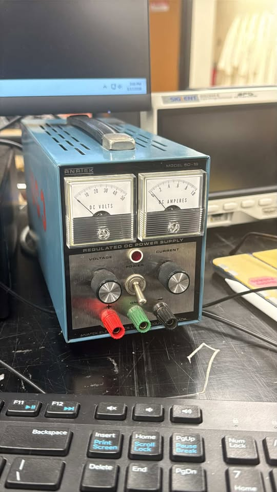

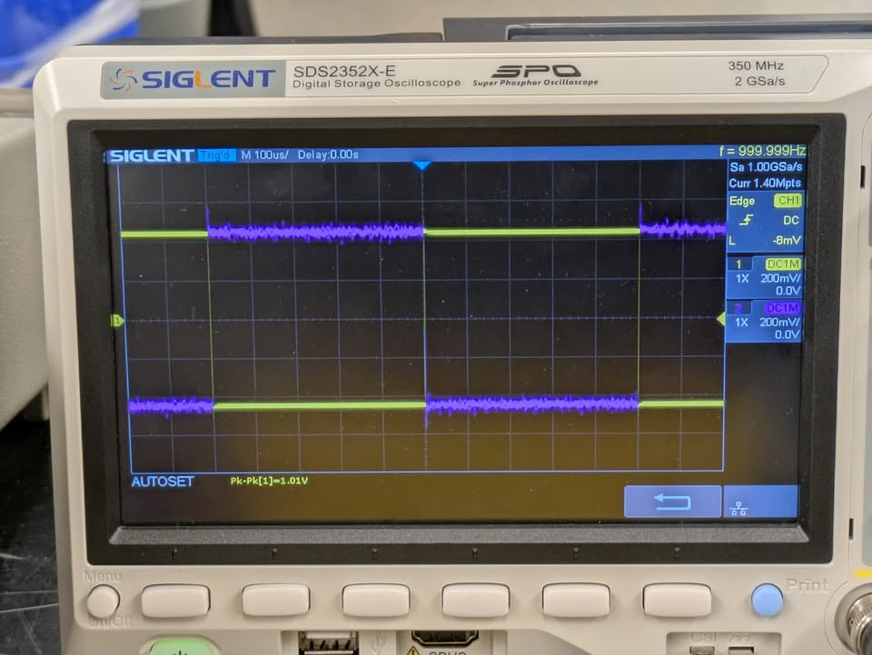

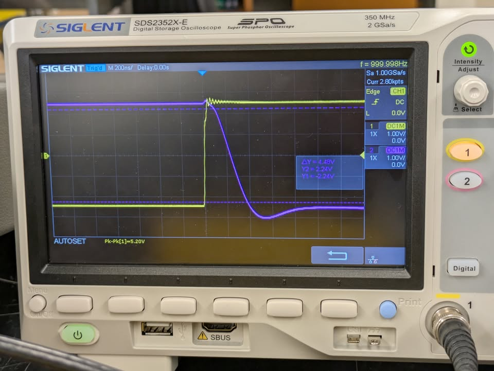

We expected V_out = -(V_in,1 + V_in,2) but that didn't happen. Switching on the DC output only stabilised the signal, but only changing the function generator input changes V_out on the oscilloscope. The AC amplitude should stay the same regardless of DC offset -- only the DC level of V_out should shift.

## XVI. BEGIN PART II: NONLINEAR ELEMENT D(x)

**Reference:** Lab Script p. 7, Part II step 1-2; Fig. 1b

**Circuit:** Two 1N4148 diodes in antiparallel configuration with R₁ ≈ 2 kΩ, R₂ ≈ 12 kΩ (R₂/R₁ ≈ 6).

**How D(x) works:**
- When V_in > 0: diodes reverse-biased, D(x) ≈ 0
- When V_in < 0: diodes conduct, acts as inverting amp with gain -R₂/R₁

$$D(x) = -\frac{R_2}{R_1} \min(x, 0)$$

This is a piecewise-linear function.

**Virtual circuit planning:**

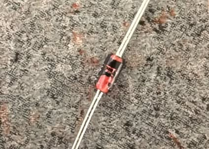

**Testing:** 1 kHz sawtooth ramp input.

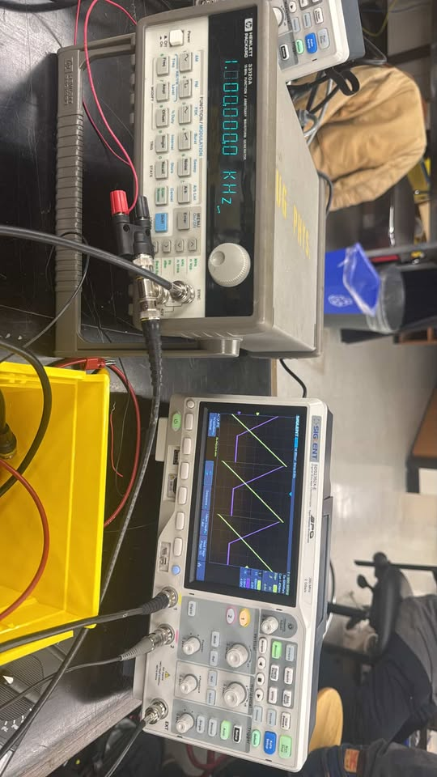

**XY Mode Test:** Set oscilloscope to XY mode to display D(x) vs x directly.

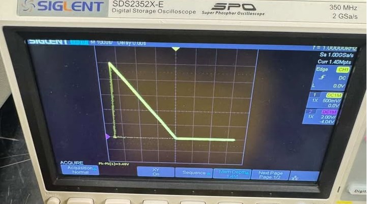

**Measurement stats (from oscilloscope):**

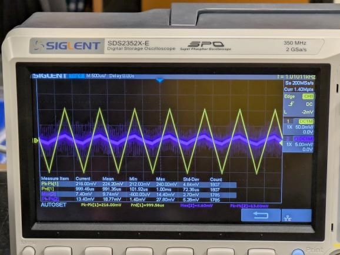

**Measured values:** R₁ ≈ 2 kΩ, R₂ ≈ 12 kΩ, R₂/R₁ ≈ 6. Oscilloscope: Siglent SDS2352X-E.

## XVII. SESSION 2 ANALYSIS

| Experiment | Status | Key Result |
|------------|--------|------------|
| Breadboard verification | Completed | 31 V rail-to-rail, 15.45 V to ground |
| Exp 2: Variable gain | Completed | |G| matches R₂/R₁ at 10 kΩ and 100 kΩ |
| Exp 3: Integrator | Completed | Changed function gen + BNC helped |
| Exp 4: Summing amp | Completed | V_out did not match simple sum prediction |
| Pre-lab Q1 | Handed in | ODE derived, 3 regimes identified |
| D(x) nonlinear element | Completed | XY mode confirms piecewise-linear |

## XVIII. CONCLUSIONS

**Part I Summary:**
- All 4 op amp experiments completed across 2 sessions
- Golden rules verified: inverting amp gain matches -R₂/R₁
- Key lessons: ground probes, check BNC, replace suspect op amps, verify breadboard with DMM

**Part II Progress:**
- D(x) successfully built and tested with R₂/R₁ ≈ 6
- XY mode confirmed piecewise-linear behaviour
- Ready for full jerk circuit in Session 3

**Outstanding:** Exp 4 result did not match prediction -- needs investigation.

## XIX. PLAN FOR SESSION 3

**Lab Period 3** (Lab Script Timeline):
1. Learn to connect oscilloscope to laptop, download drivers
2. Build full jerk circuit (Lab Script Fig. 1a) -- three integrators + summing amp + D(x)
3. Test each integrator separately first (500 kΩ temp feedback -- Lab Script p. 8, step 4)
4. Observe chaos -- vary R_v for period doubling, bifurcation, chaotic regimes
5. Use 1 nF capacitors (not 1 μF from Kiers et al.) -- 1000x faster
6. Begin Pre-lab Q2: derive Eqs. 2-6 from Kiers et al.
